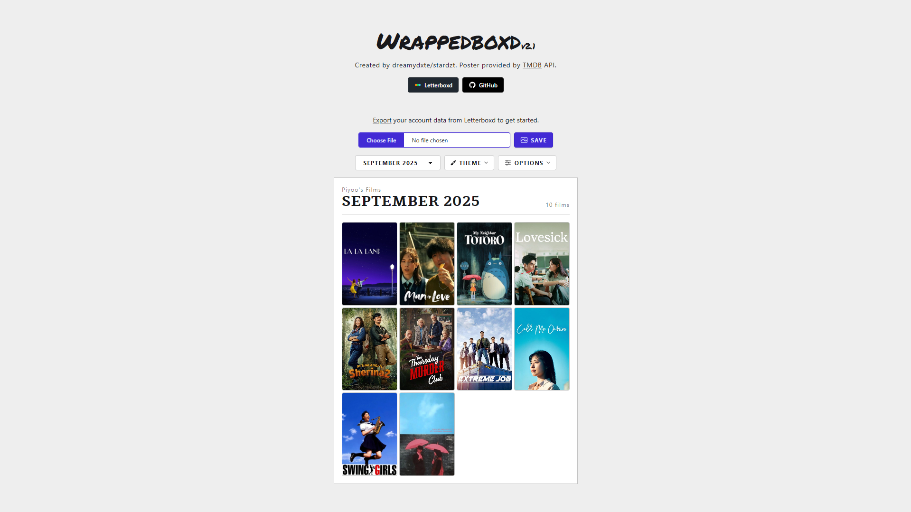

# Wrappedboxd

A simple web application that converts user diary from Letterboxd into a downloadable image template. Powered by Letterboxd API and TMDB API. You can visit the site here https://wrappedboxd.netlify.app/

Key features:
- Display your film watches based on months.
- Option to show title, rating, and watched date.
- Option to change film posters.
- Option to change theme.

Requirement:
- Letterboxd account with active diary log.

How to use:
- Visit https://letterboxd.com/settings/data/
- Export your data.
- Import your newly-dowloaded data into Wrappedboxd.
